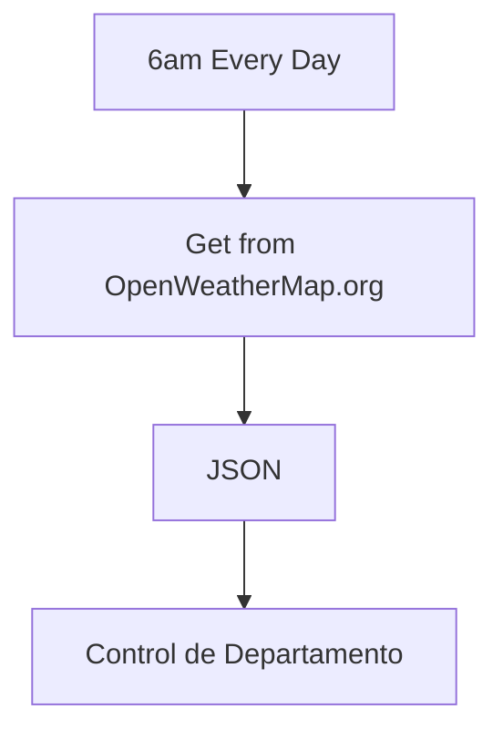

# Node-Red - Conocer la Hora

En [Node-Red](http://localhost:1880/) se realizarán una serie de flows que permiten ejecutar las funciones básicas del departamento. La primera sección consiste en crear una serie de comodidades.

La primer comodidad será un esquema de alarmas con Alexa y una serie de directivas de encendido-apagado de focos inteligentes, para lo cual se requiere que el sistema conozca la hora.

La hora se obtiene del sistema. 

Dado que las funciones de control de luces y alexa están asociadas al amanecer y anochecer, es necesario conocer la hora del amanecer y atardecer, para lo cual se usará openweathermap.org.

## Requisitos

- Windows
- Docker Desktop. La versión de Windows ya incluye docker-compose (opcional)
- WSL2
- Ubuntu (WSL2)
- Node-Red, de preferencia corriendo en Docker
- Cuenta gratuita de Open Weather Map

## Aclances

Las funciones que se explicarán funcionan sobre el sistema del proyecto, no se han probado con configuraciones diferentes

- Conexión WiFi de 2.4GHz
- Cifrado AES-WPA2, el mas común en modems WiFi casa habitación y el predeterminado del ESP32CAM
- Canal WiFi atomático
- Configurar el modem para aceptar de 24 a 32 dispositivos WiFi conectados simultaneamente
- Las configuraciones de esta documentación asumen que se usará un equipo de cómputo funcionando permanentemente

En este documento se describen únicamente las funciones de flow, no se explica en detalle cómo hacerlo, ya que se asume que se obtendrá del repositorio.

## Diagrama


## Instrucciones

Este instructivo explica las configuraciones de optimización en AgentDVR para realizar la grabación continua de 6 cámaras y un micrófono ambiental.

### Crear un nuevo flow

Para crear un nuevo flow, haz clic en el botón **+** ubicado en la esquina superior derecha de la interfaz de [Node-Red](http://localhost:1880/). Puedes hacer doble clic en la pestaña que representa el flow para asignarle un nombre. En mi caso, el flow actual se llamará Cron, dado que administrará varias funciones temporalizadas del sistema.

### Sección TimeNow

Esta sección es un seguidor de tiempo, sirve para que Node-Red conozca en todo momento la hora del sistema. Se lanza cada segundo con ayuda de un Nodo Inject, llamdo **Every 1 sec - Master**, el cual se conecta a un Nodo Function llamado **Set timeNow**, que registra una variable global con el timestamp del sistema. Esta configuración permitirá que cualquier flow del proyecto pueda acceder a la hora actual del sistema consultando la variable global.

### Sección Calcular amanecer-anochecer-medianoche

Esta sección tiene como propósito calcular la hora de amanecer y anochecer todos los días a las 6 de la mañana. Esto se logra con un Nodo Inject llamado **6am every day**, configurado para activarse todos los días a las 6h. Se conecta a un Nodo http Request llamado **Get from openWheatherMap.org**, que solicita los datos de amanecer y anochecer.

La petición http hace una solicitud GET a [openweathermap.org](https://openweathermap.org/) esta basada en la [API Weather](https://openweathermap.org/current). Para que funcione, es necesario contar con una [API Key](https://home.openweathermap.org/api_keys), la cual puedes obtener gratuitamente.

Esta petición proporcona datos básicos del clima, como temperatura y humedad relativa actual. Adicionalmente proporciona hora de amanecer y anochecer. Uno de los elementos que deben enviarse como aprte de la **API Call** son las coordenadas geográficas. En mi caso, he seleccionado las coordenadas del centro de la ciudad de México:

```
lat=19.432659 lon=-99.133595
```
Open Weather Map responde con un JSON, por lo que al Nodo Http Request se le conecta un Nodo JSON llamado **json**, configurado para siempre convertir a Java Script Object, lo que facilita el manejo de variables en Node-Red.

Finalmente, se conecta un Nodo Function llamado **Control de departamento**, el cual contiene inicialmente el siguiente código:

```
// Calcular timestamp horas importantes
let now = new Date();
now.setHours(18, 0, 0, 0);
let timestamp = now.getTime();
global.set("midnight", now.getTime() + 43200000);
global.set("sunrise", msg.payload.sys.sunrise * 1000);
global.set("sunset", (msg.payload.sys.sunset * 1000) - 7200000);
global.set("sunriseTomorrow", (msg.payload.sys.sunrise * 1000) + 86400000)

return msg;
```
Este código establece la hora de media noche, amanecer, atardecer y el amanecer del día siguiente. Se calculan todos ellos para compenzar el hecho de que esta solicitud se realice a una hora arbitraria (6h) y la posibilidad que un corte de energía haga necesario detonar esta obtención de datos en cualquier momento del día.

Mas adelante, este nodo llamado **Control de departamento** contendrá el calculo de mas variables globales que serán usadas por el reso del sistema y que se deben obtener actualizar todos los días.

### Correr el Flow

Finalmente, se hace clic en el botón **Deploy**, el cual debe estar configurado como **Modified Nodes** con el objetivo de permitir modificaciones sin interferir mas adelante con los nodos del servidor de Alexa. Esto se explicará en detalle mas adelante.

## Referencias
- [Documentación de Node-Red](https://nodered.org/docs/user-guide/). Documentación oficial de Node-Red.
- [Node-Red Core Nodes](https://nodered.org/docs/user-guide/nodes). Incluye descripcion del funcionamiento de los nodos Inject, Debug y Function.
- [OpenWeatherMap Weather API](https://openweathermap.org/current).
- [API Key](https://home.openweathermap.org/api_keys).